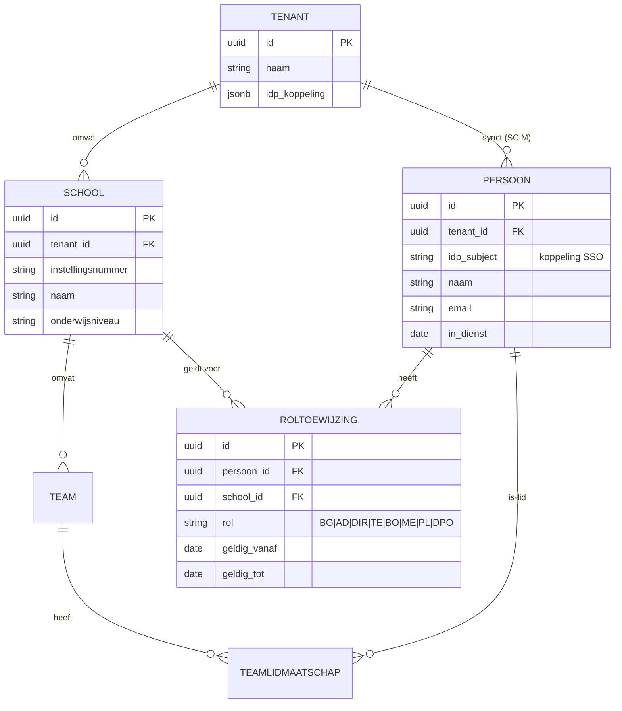
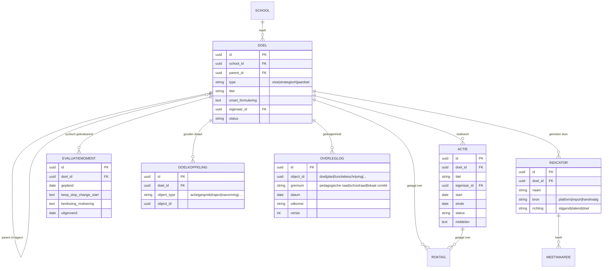
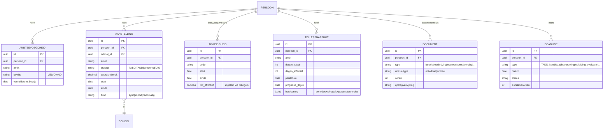
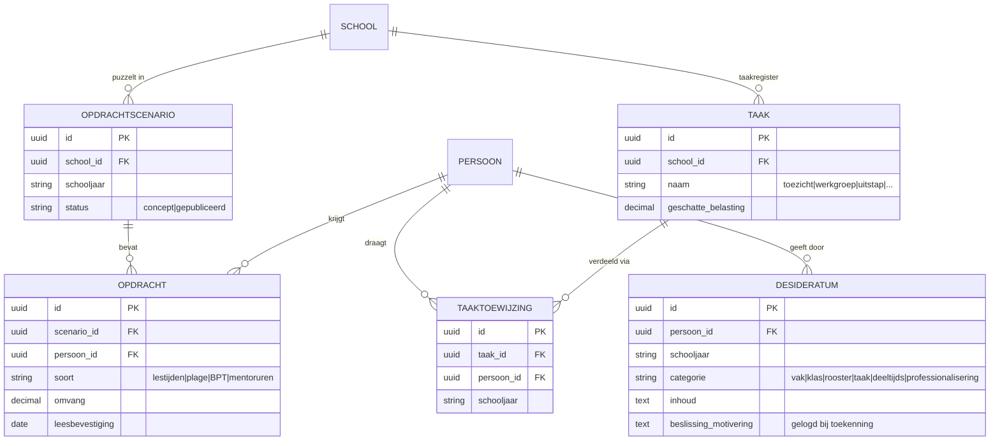
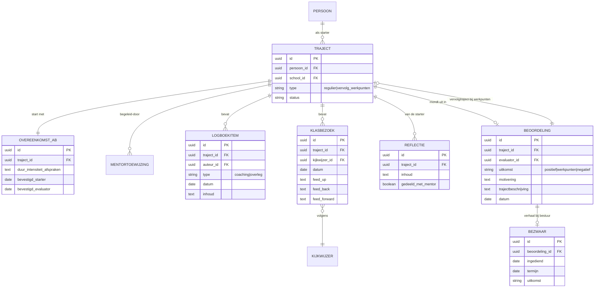
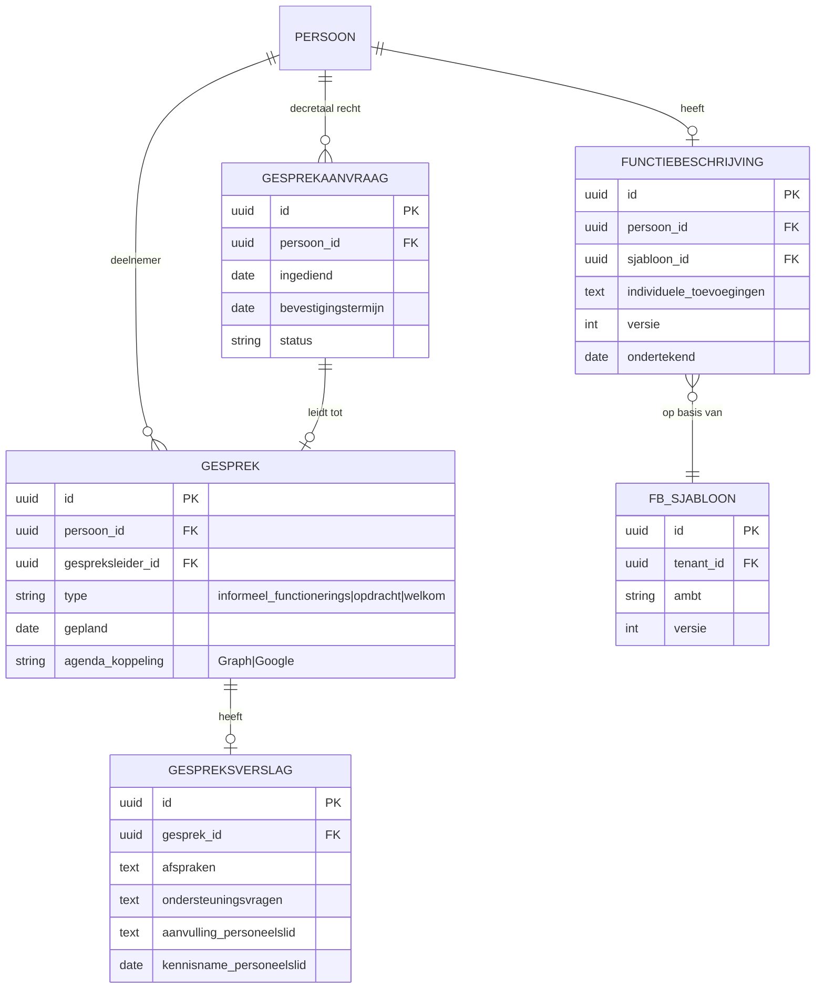
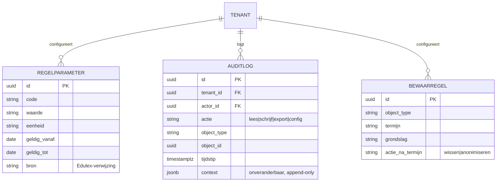

# Datamodel — Fase 1 (MVP)

Conceptueel datamodel voor de MVP-modules (A, B, C, D, E-spoor 1), conform blauwdruk § 9. Het model is netneutraal en multi-tenant: **elke rij draagt `tenant_id` (scholengroep) en waar van toepassing `school_id`**, afgedwongen met row-level security in PostgreSQL — onafhankelijk van applicatielogica.

## 1. Organisatie & identiteit

Identiteit wordt gesynchroniseerd vanuit het identiteitsplatform (Entra ID / Google Workspace via SCIM); Draagvlak is nooit de bron van identiteitsgegevens.

## 2. Module A — Strategie

De doelenboom is één hiërarchie met vier lagen (visie → strategisch doel → jaardoel → actie); de laag zit in `type`, de hiërarchie in `parent_id`. Elk koppelbaar object in het platform verwijst via `DOELKOPPELING` naar een knoop — dat is de technische vorm van "de gouden draad".

## 3. Module B — Personeelsdossier & tellers

Tellers worden nooit opgeslagen als "waarheid" maar altijd herleidbaar berekend uit `AANSTELLING` + `AFWEZIGHEID` + de geldende `REGELPARAMETER`-versies; `TELLERSNAPSHOT` cachet het resultaat mét verantwoording.

## 4. Module C — Opdrachten & desiderata

## 5. Module D — Aanvangsbegeleiding & beoordeling

Het trajectdossier (coaching) en het beoordelingsverslag (formeel) zijn **gescheiden objecten met gescheiden rechten**; het logboek is leesbaar voor de eerste evaluator, maar de beoordeling verwijst er hooguit naar.

## 6. Module E — spoor 1: gesprekkencyclus

## 7. Systeemlaag

## 8. Ontwerpnotities

- **Gouden draad als koppeltabel.** `DOELKOPPELING` is polymorf (object_type + object_id) zodat elke module — ook toekomstige (navormingen, PLG's, welbevindenacties) — zonder schemawijziging aan de doelenboom kan koppelen. De strategiecockpit is een query over deze tabel.
- **Dossiertype als hard attribuut.** `DOCUMENT.dossiertype` (`ontwikkel` | `formeel`) stuurt de rechten en maakt de scheiding ontwikkeling↔beoordeling controleerbaar op databankniveau; een foreign key-constraint verhindert dat ontwikkelobjecten aan een formeel dossier hangen.
- **Berekend, niet beweerd.** `TELLERSNAPSHOT.berekening` bewaart de volledige verantwoording (periodes, telregels, parameterversies) zodat elke teller uitlegbaar en reproduceerbaar is — de basis van het vertrouwen in de deadline-engine.
- **Append-only audit.** `AUDITLOG` is technisch append-only (geen UPDATE/DELETE-rechten, ook niet voor de applicatierol); export voor juridische procedures gebeurt via een aparte, gelogde functie.
- **Voorbereid op Fase 2-3.** Pseudonimisering (scheiding identiteit ↔ antwoorden) is in Fase 1 nog niet nodig — er zijn geen meetdata — maar het schema reserveert er ruimte voor: metingtabellen komen in een apart schema met een sleuteltabel die alleen een aparte servicerol kan lezen.
